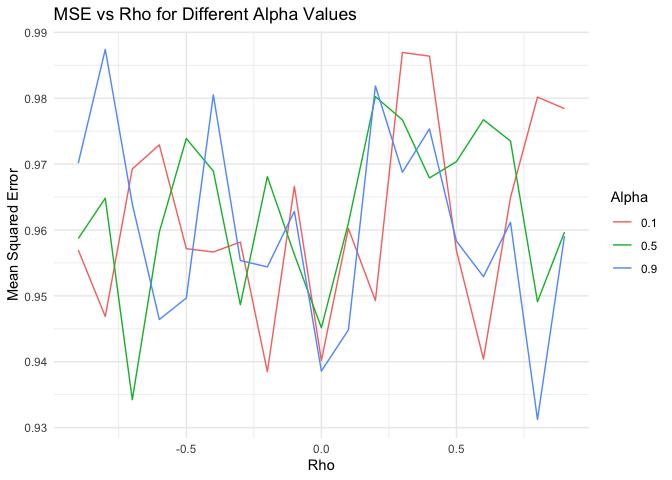
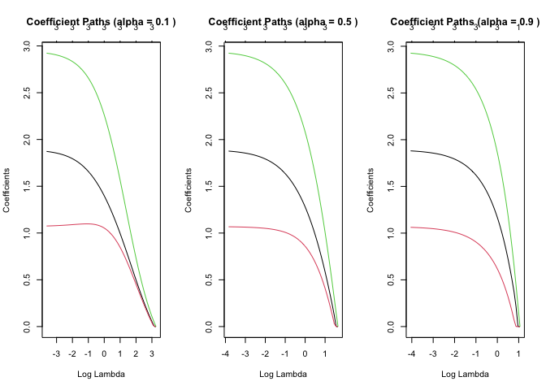

Performance Analysis of the Elastic Net Regularization Method
================

``` r
# Load necessary libraries
# MASS: for multivariate normal simulation
# glmnet: for Elastic Net model fitting
# ggplot2: for visualization
# reshape2: for data reshaping used in plotting
library(MASS)
library(glmnet)
library(ggplot2)
library(reshape2)
```

``` r
# Set a random seed to ensure reproducibility of the simulation results
set.seed(123)
```

``` r
# Define a function to generate synthetic data from a multivariate normal distribution
# using a manually specified covariance matrix with validation for positive definiteness
generate_data <- function(p, n, rho, beta) {
  if (p == 3) {
    Sigma <- matrix(c(1, rho, 0,
                  rho, 1, 0,
                  0, 0, 1), nrow = 3, byrow = TRUE)
  } else {
    Sigma <- matrix(0, nrow = p, ncol = p)
    for (i in 1:p) {
      for (j in 1:p) {
        Sigma[i, j] <- rho^abs(i - j)  # AR(1) correlation structure
      }
    }
  }
  
  if (all(eigen(Sigma)$values > 0)) {
    L <- chol(Sigma)  # Cholesky decomposition
    X <- matrix(rnorm(n * p), nrow = n) %*% L  # Generate correlated predictors
    X <- scale(X)  # Standardize predictors
    epsilon <- rnorm(n)  # Random noise
    Y <- X %*% beta + epsilon  # Linear model with noise
    list(X = X, Y = Y)  # Return generated predictors and response
  } else {
    stop("Covariance matrix is not positive definite.")
  }
}
```

``` r
# Define a function to run Elastic Net regression for a range of alpha values
# and return the lambda, MSE, and number of selected predictors for each
run_elastic_net <- function(X, Y, alphas) {
  results <- data.frame()
  for (alpha in alphas) {
    cv_fit <- cv.glmnet(X, Y, alpha = alpha)  # Cross-validated Elastic Net
    lambda_min <- cv_fit$lambda.min  # Optimal penalty parameter
    y_pred <- predict(cv_fit, newx = X, s = lambda_min)  # Predictions
    mse <- mean((Y - y_pred)^2)  # Mean squared error
    nonzero <- sum(coef(cv_fit, s = lambda_min) != 0) - 1  # Count non-zero coefficients
    results <- rbind(results, data.frame(alpha, lambda_min, mse, nonzero))
  }
  results  # Return result summary
}
```

``` r
# Monte Carlo simulation to evaluate Elastic Net performance across different
# correlation levels (rho) and mixing parameters (alpha)
monte_carlo_sim <- function(p, n, rho_values, alphas, beta, reps = 100) {
  mse_matrix <- matrix(0, nrow = length(rho_values), ncol = length(alphas))
  colnames(mse_matrix) <- alphas
  rownames(mse_matrix) <- rho_values

  for (i in seq_along(rho_values)) {
    rho <- rho_values[i]
    for (j in seq_along(alphas)) {
      alpha <- alphas[j]
      mse_values <- numeric(reps)
      for (k in 1:reps) {
        data <- generate_data(p, n, rho, beta)
        cv_fit <- cv.glmnet(data$X, data$Y, alpha = alpha)
        y_pred <- predict(cv_fit, newx = data$X, s = cv_fit$lambda.min)
        mse_values[k] <- mean((data$Y - y_pred)^2)
      }
      mse_matrix[i, j] <- mean(mse_values)  # Average MSE for each (rho, alpha)
    }
  }
  mse_matrix  # Return the MSE matrix
}
```

``` r
# Define alpha values and sample size
alphas <- c(0.1, 0.5, 0.9)
n <- 100

# SMALL dataset scenario (p = 3): correlated data with known beta coefficients
beta_small <- c(2, 1, 3)
data_small <- generate_data(3, n, rho = 0.8, beta = beta_small)
results_small <- run_elastic_net(data_small$X, data_small$Y, alphas)
print(results_small)
```

    ##   alpha lambda_min      mse nonzero
    ## 1   0.1 0.02658910 1.062159       3
    ## 2   0.5 0.02146813 1.062140       3
    ## 3   0.9 0.01730366 1.062107       3

``` r
# LARGE dataset scenario (p = 10): all coefficients set to 1
beta_large <- rep(1, 10)
data_large <- generate_data(10, n, rho = 0.8, beta = beta_large)
results_large <- run_elastic_net(data_large$X, data_large$Y, alphas)
print(results_large)
```

    ##   alpha lambda_min      mse nonzero
    ## 1   0.1  0.5635821 1.238070      10
    ## 2   0.5  0.1237061 1.207773      10
    ## 3   0.9  0.0431617 1.201197      10

``` r
# Run Monte Carlo simulation across varying correlation values
rho_values <- c(seq(-0.9, -0.1, by = 0.1), 0, seq(0.1, 0.9, by = 0.1))
mse_matrix <- monte_carlo_sim(3, 100, rho_values, alphas, beta_small, reps = 100)

# Reshape and label the data for plotting
mse_df <- melt(mse_matrix)
colnames(mse_df) <- c("Rho", "Alpha", "MSE")

# Plot the relationship between predictor correlation and model performance
# across different values of alpha (Elastic Net mixing parameter)
ggplot(mse_df, aes(x = as.numeric(Rho), y = MSE, color = factor(Alpha))) +
  geom_line() +
  labs(
    title = "MSE vs Rho for Different Alpha Values",
    x = "Rho",
    y = "Mean Squared Error",
    color = "Alpha"
  ) +
  theme_minimal()
```

<!-- -->

``` r
# Visualize coefficient paths for different alpha values
plot_coefficient_paths <- function(X, Y, alpha) {
  fit <- glmnet(X, Y, alpha = alpha)
  plot(fit, xvar = "lambda", label = TRUE, main = paste("Coefficient Paths (alpha =", alpha, ")"))
}

# Plot coefficient paths for alpha = 0.1, 0.5, and 0.9
par(mfrow = c(1, 3))
plot_coefficient_paths(data_small$X, data_small$Y, alpha = 0.1)
plot_coefficient_paths(data_small$X, data_small$Y, alpha = 0.5)
plot_coefficient_paths(data_small$X, data_small$Y, alpha = 0.9)
```

<!-- -->

``` r
par(mfrow = c(1, 1))
```
